**Text Analytics on Food.com Recipes/Review Data**
============================================================================================

**Part 1 - DEFINE**
============================================================================================

#### **Define the problem**

Food.com is a place where you can find recipes and reviews for that recipes
given by thousands of customers. It is a social networking platform for people
who like to try new recipes and people who like to make new recipes.

1.  It would be very helpful if given a review for a recipe, the **polarity of
    that review** can be predicted. So, I wanted to do sentiment analysis on the
    review data for recipes.

2.  Surprisingly there is no Cuisine information for recipe. So, I wanted to
    **classify recipes** into different cuisines by training using external data
    on cuisine information.

3.  **Word clouds** to see word frequencies and visually presenting text data.

4.  Perform **clustering over the ingredients** and draw meaningful insights

    from the clusters formed.

5.  **Market Basket Analysis** using **Apriori** algorithm on Ingredients data
    to find **associations between products** in cart and increase revenue.

**Part 2 – DISCOVER**
============================================================================================
The data is from following Kaggle sources

RAW_interactions
: <https://www.kaggle.com/shuyangli94/food-com-recipes-and-user-interactions#RAW_interactions.csv>

RAW_recipes
: <https://www.kaggle.com/shuyangli94/food-com-recipes-and-user-interactions#RAW_recipes.csv>

Cuisine Data: <https://www.kaggle.com/kaggle/recipe-ingredients-dataset>

Food.com boasts a veritable smorgasbord of over 500,000 recipes and a
community-inspired activity feed that allows users to share reviews.

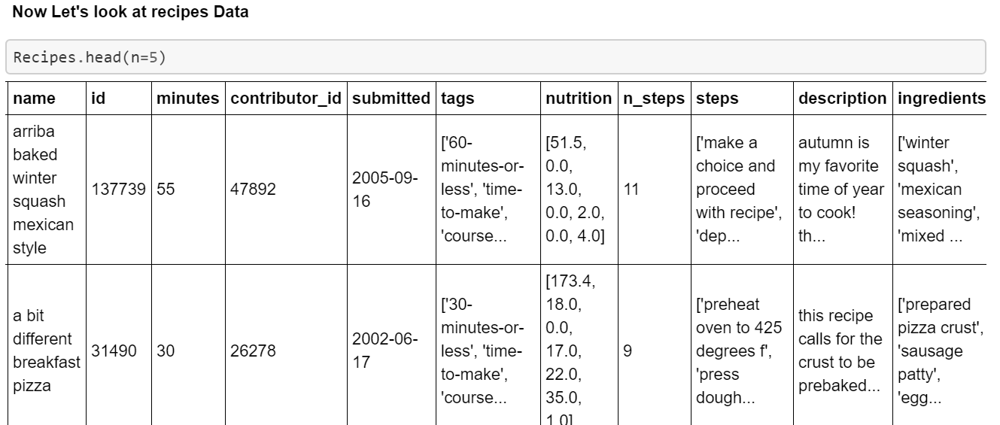

#### **Clean the data**

Some columns like nutritional values and ingredients are read as strings by
python rather than list objects.

1.  We will convert ingredients to list objects so that we can use them as
    iterables while text processing.

2.  We will convert nutritional values column to columns of nutritional values
    so that we can use them for comparison of different recipes nutritional
    values.

**EDA**

**There are many outliers in many columns of the data. I removed them by setting
my lower and upper bound as : lower bound = Q1 - 1.5 IQR upper bound = Q3 + 1.5
IQR.**

**Removed the missing values from the data by dropping the rows containing any
missing values.**

**Data Looks as below after removing outliers**

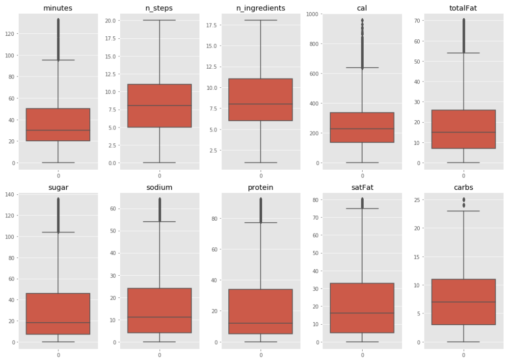

**Part 3 - DEVELOP**
============================================================================================
**Engineer features**

**Feature Engineering Cuisine**

-   It would be very helpful if we know which cuisine a recipe belongs to. So
    that we can further analyze things like which cuisine have more positive
    reviews, which cuisine have high nutritional value etc.

-   I've searched the datasets which contain cuisine information and found a
    dataset that has ingredients and cuisine information.

-   We can use that data to train a model and use trained model to predict
    cuisines for our dataset.

**The data looks like,**

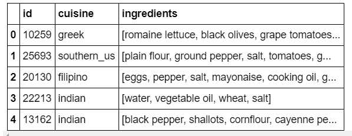

As we are dealing with textual data, we must vectorize ingredients text.

**I’ve tested various methods for this including BOW, TF-IDF, Word2Vec, Avg
Word2Vec, TF-IDF weighted Word2Vec for Vectorizing.**

**TF-IDF gave better performance compared to other techniques.**

-   **XGBoost model has the best accuracy scores after trying several models in
    my research**

-   **We will use XGBoost model to train a model to predict cuisines given
    ingredients**

-   **First, we will split dataset into train and test sets.**

-   **We will use train set for hyper parameter tuning using random search**

-   **We will use test set to see how well our trained model performs on unseen
    data**

**How accurate is the model ?**

We will measure,

-   The Accuracy of the model

-   Classification rate (Using classification report for each class in target)

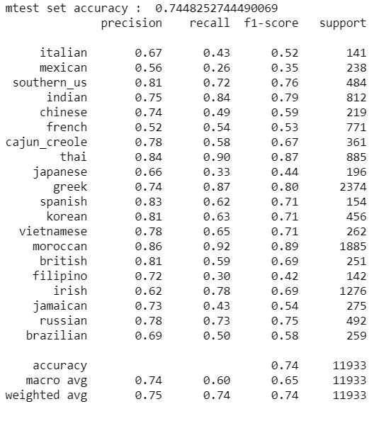

**Now our model is ready to be used and we can predict the cuisine given the
ingredients.**

-   **We just must make sure that since we trained our model with the TF_IDF
    vectorizer we must use the same for Transforming original Ingredients text
    data.**

-   **We will now predict cuisines for the original data set using the same
    model we trained on previously (XGBoost).**

**We added cuisine information for each recipe!!**

Now we will look into various visuals that answer many questions we have regarding cuisines.
============================================================================================

**Which cusine have average highest Ratings?**

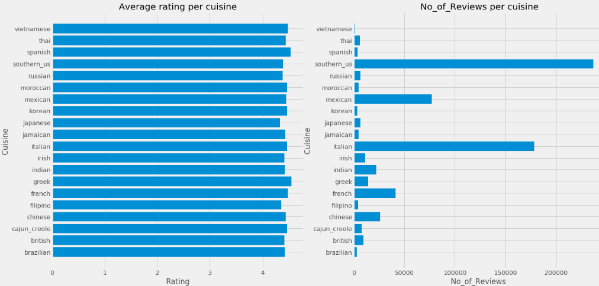

What is the count of recipes we have for each cuisine in food.com and what are
the average number of minutes per cuisine?

Sentiment Classification
========================

-   Objective of the text analysis task we are trying to do: Given a review,
    determine whether the review is positive (Rating of 4 or 5) or negative
    (rating of 1 or 2).

-   But how to determine if a review is positive or negative?

-   We could use the Rating column. A rating of 4 or 5 can be considered a
    positive review. A review of 1 or 2 can be considered as a negative review.
    A review of 3 is neutral and ignored.

-   This is an approximate and proxy way of determining the polarity
    (positivity/negativity) of a review.

-   **There is a serious class imbalance problem with our data**

-   **The issue of class imbalance can result in a serious bias towards the
    majority class, reducing the classification performance and increasing the
    number of false negatives**

-   **We do under-sampling the majority class as this will result in increasing
    the "numerical stability" of our resulting models.**

-   **Before doing all these splitting we have to preprocess the data so that
    every split of data have undergone through same data manipulations**

As we are dealing with review text, we must preprocess it before vectorizing.

**Text Preprocessing**
============================================================================================
**In the Text Preprocessing phase, we do the following in the order below:** -

1.  **Begin by removing the html tags**

2.  **Remove any punctuations or limited set of special characters like, or . or \# etc.**

3.  **Check if the word is made up of English letters and is not alpha-numeric**

4.  **Check to see if the length of the word is greater than 2 (as it was researched that there is no adjective in 2-letters)**

5.  **Convert the word to lowercase**

6.  **Remove Stop words**

7.  **Finally, Snowball Stemming the word (it was observed to be better than Porter Stemming) and lemmatizing the words.**

**Now the review text is preprocessed and ready for modeling!**

1.  **We will first divide the dataset into Test Train sets and perform under sampling only on the majority class of train set.**

2.  **We will keep test set aside for our model performance measurement.**

Featurization & Sentiment Classification
========================================

-   **I’ve tested various methods for Featurization including BOW, TF-IDF, Word2Vec, Avg Word2Vec, TF-IDF weighted Word2Vec.**

-   **TF-IDF vectorizer with naïve Bayes as baseline gave best AUC score of 78.5% in classifying sentiment of reviews.**

    
    
**Part 4 - DEPLOY**
============================================================================================
**Predictive Modelling**
========================

-   **After looking at baseline result of Naive Bayes for each type of vectorization. We see TF-IDF performed better. SO, we will use TF-IDF vector representations of text and build more complex models to see if we get better AUC score than baseline.**

-   **I've implemented Gradient Boosting and Neural Network algorithms and tuned their Hyper-parameters to increase the AUC. The models are:**

1.  **XGBoost Gradient Boosting Classifier**

    

2.  **MLP Neural Networks**

    

**XGBClassifier gave the best Test_AUC score. So, we will use that for
predictions on new data.**

**Now we will look at word cloud of reviews to see the most used words in recipe
reviews**

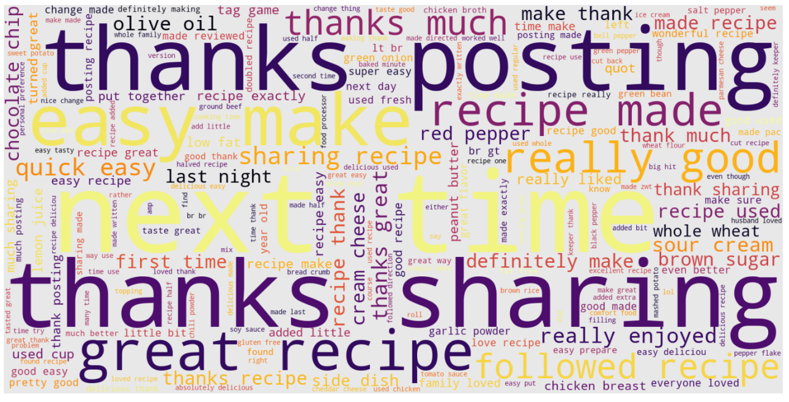

**Clustering**
===============================================================================================================

-   **By looking at the above visualization we can clearly observe the
    domination of some cuisines over other cuisines and surprisingly we see
    almost similar ratings for each cuisine. There's not much of a trend**

-   **The number of ratings per cuisine doesn't specifically give us any
    information given the high volumes of recipes for specific cuisines.**

-   **We can further dive deep into this and research if we can find some
    interesting answers to questions like what king of recipes group together
    and what kind of recipes become more popular based on some other factors in
    the data.**

-   **We can use clustering for this kind of un-supervised learning task.**

Clustering to Dig deep into recipe ratings
==========================================

I have clustered data points using the ingredients data to see if we I can find any interesting patterns in those clusters
==========================================================================================================================

**I decided on no of clusters using Inertia and silhouette score analysis.**

**I’ve used truncated SVD ON sparse matrix to reduce the dimensionality of
data.**

**elbow plot to find optimum number of clusters**

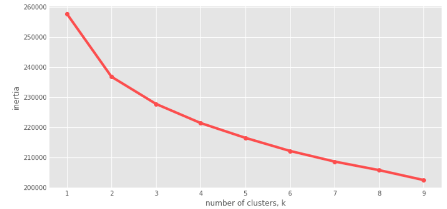

From the above elbow plot, we cannot discern a K value easily. Even though the
graph is not straightforward, we have reasonable doubt between values 4,5 & 6.

In this case, we will need another method to find the optimal K from the values
4,5 & 6.

We will use the silhouette score.

Silhouette method measures how similar a point is to it’s own cluster compared
to others. It is more likely a validation rather than a decision maker. Which is
exactly what we want in this scenario.

By using Euclidean distance as the metric, we will plot the graph for silhouette
scores for the three values of K.

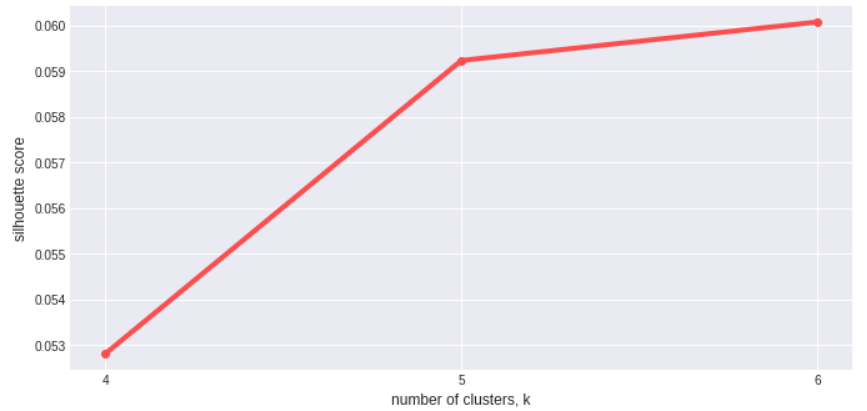

**From the above graph, we can say that the 6 is the most optimal value for K.**

**I’ve summarized the data on each cluster number to look at some properties of
those clusters.**

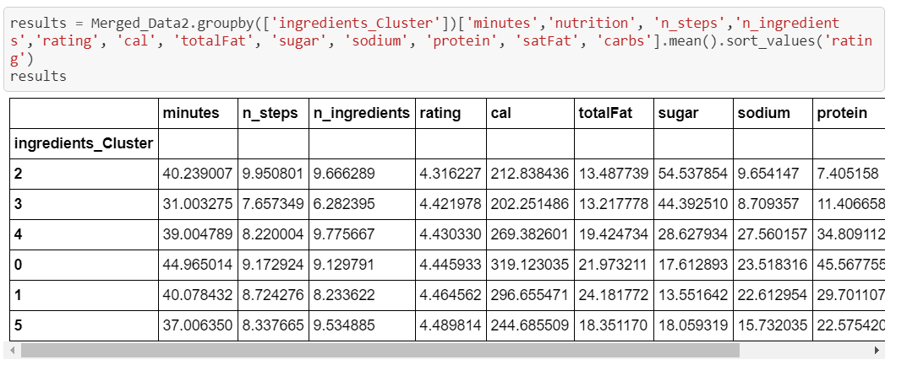

**If we observe our cluster statistics. We can see two important patters.**

1.  **Cluster that has the highest average rating has the lowest sugar values
    and the highest protein values**

2.  **cluster with the least average rating has the highest sugar values and the
    least protein values**

**So, we can say that people on Food.com are gives highest rating to health
choices that have low sugar and high protein content.**

**Now we will plot bar-plots showing the sugar and protein levels of each
cluster.**

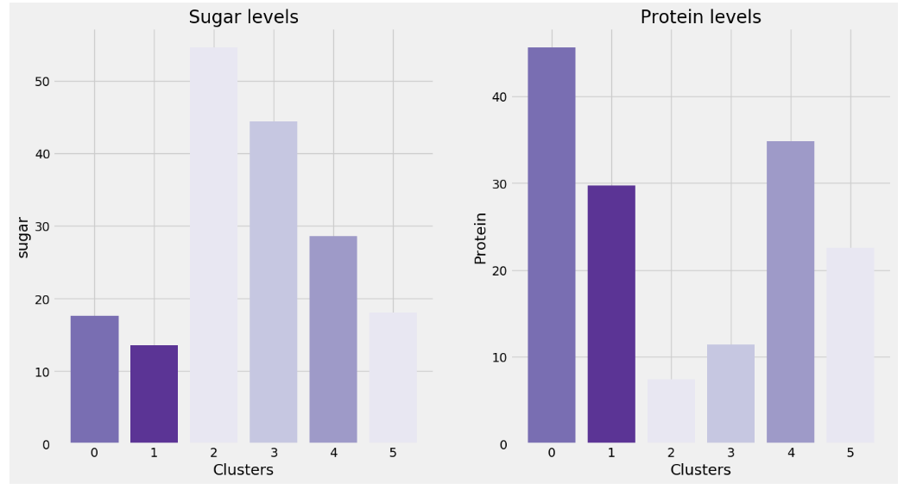

**Darker the purple color, higher the rating of the cluster.**

**So, we can see clearly from above plots that recipes with higher sugar content
and lower protein has least rating compared to recipes with High protein and low
sugar levels.**

**We will make word clouds for ingredients in most popular and least popular clusters to find any interesting patterns.**
========================================================================================

**Word cloud of ingredients for Cluster with highest ratings**

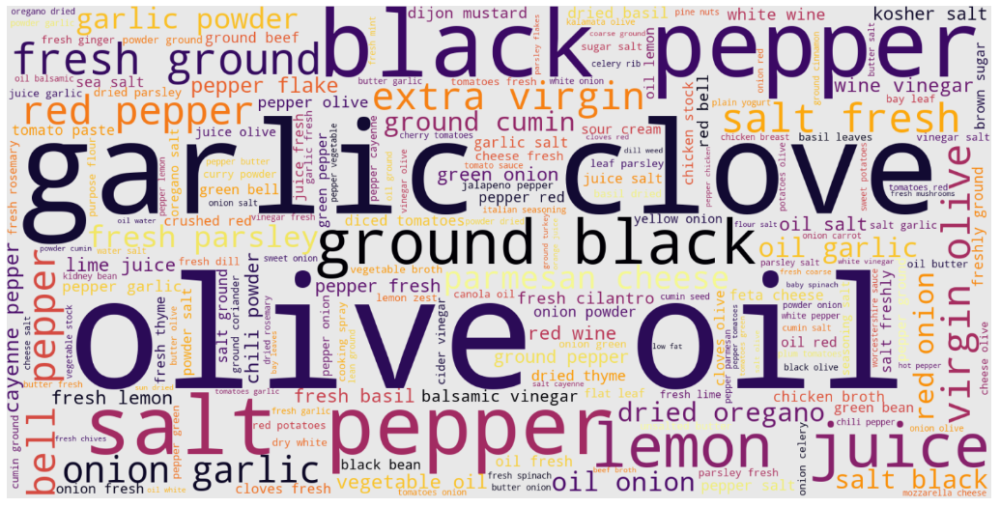

**Word cloud of ingredients for Cluster with Lowest ratings**

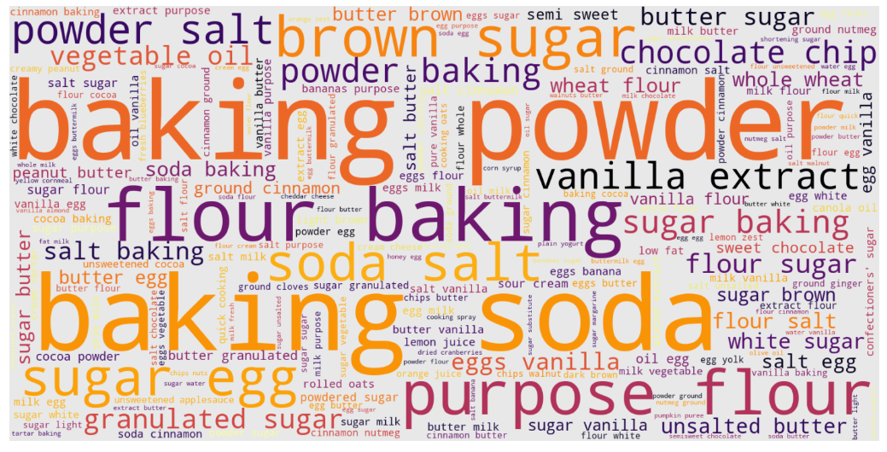

Interestingly we can observe that in highest rating word clouds there are many
healthy ingredients compared to lowest rating word clouds.

**Market Basket Analysis on Ingredients using Apriori**
========================================================================================

1.  If This Food.com wants to sell ingredients, then when is the best we can
    increase the sales of the ingredients?

2.  We should find a way to recommend additional products to customers based on
    what they have in cart.

3.  The best way to do this is by using market basket analysis by implementing
    Apriori algorithm.

4.  As we already have the common ingredients for a recipe as a list. We can use
    those lists to give input to apriori algorithm for it to learn the
    associations.

5.  I tried many parameter values of Support, Confidence and Lift for apriori
    model. I've selected min_support to be 0.0060, min_confidence=0.6,
    min_lift=3 as desired values for our Apriori algorithm.

==========================================

Below are some of the top rules given by apriori algorithm
==========================================================

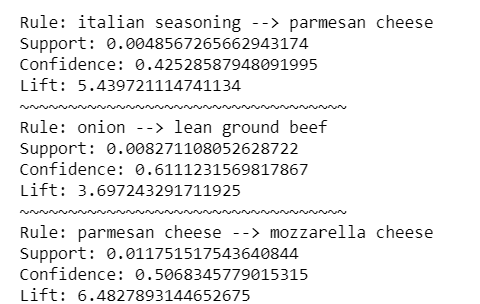
==========================================

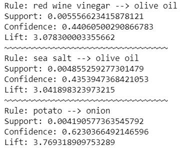

**Please check the notebook for details: https://github.com/kbpavan/Text-Analytics-on-Food.com-Recipes-Review-Data-/blob/master/Food.ipynb**
