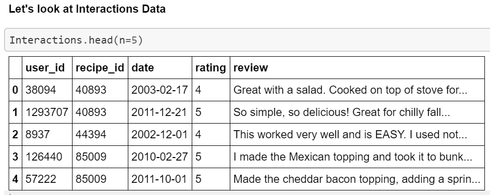
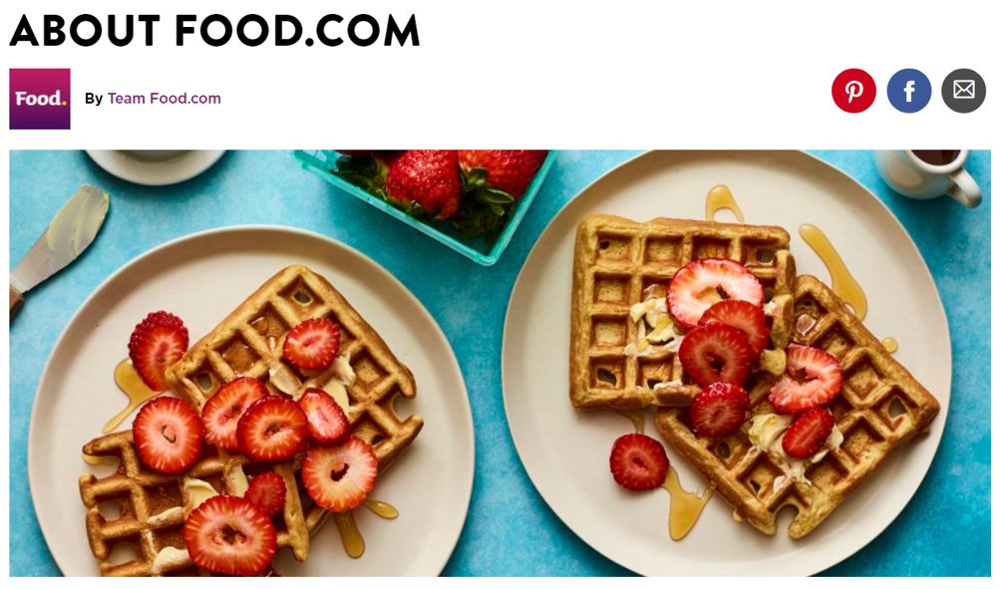
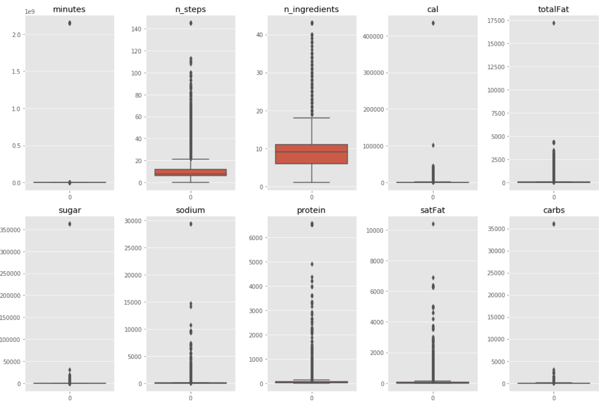
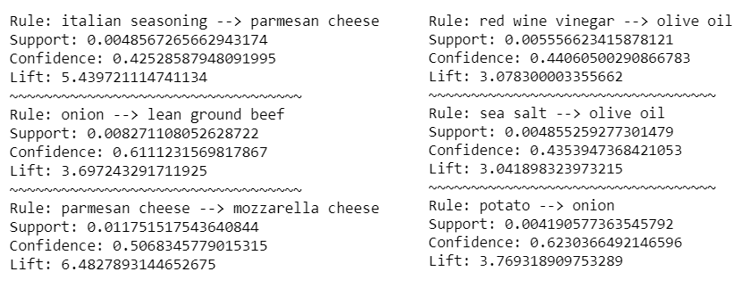

**Text Analytics on Food.com Recipes/Review Data**

### Part 1 - DEFINE

#### **Define the problem**

Food.com is a place where you can find recipes and reviews for that recipes
given by thousands of customers. It is a social networking platform for people
who like to try new recipes and people who like to make new recipes.

1.  It would be very helpful if given a recipe, the **polarity of a review** can
    be predicted. So, I wanted to do sentiment analysis on the review data for
    recipes.

2.  There is no cuisine information for each recipe. So, I wanted to **classify
    recipes** into different cuisines by training using external data on cusine
    information.

3.  Perform **clustering over the ingredients** and draw meaningful insights

4.  **Market Basket Analysis** on Ingredients data to increase revenue

### Part 2 – DISCOVER

The data is from following Kaggle sources

RAW_interactions
: <https://www.kaggle.com/shuyangli94/food-com-recipes-and-user-interactions#RAW_interactions.csv>

RAW_recipes
: <https://www.kaggle.com/shuyangli94/food-com-recipes-and-user-interactions#RAW_recipes.csv>

Cuisine Data: <https://www.kaggle.com/kaggle/recipe-ingredients-dataset>

Food.com boasts a veritable smorgasbord of over 500,000 recipes and a
community-inspired activity feed that allows users to share reviews.

#### **Clean the data**

Some columns like nutritional values and ingredients are read as strings by
python rather than list objects.

1.  We will convert ingredients to list objects so that we can use them as
    iterables while text processing.

2.  We will convert nutritional values column to columns of nutritional values
    so that we can use them for comparison of different recipes nutritional
    values.

**EDA**

**There are many outliers in many columns of the data. I removed them using
IQR**

**Removed the missing values from the data by dropping the rows containing any
missing values.**

### Part 3 - DEVELOP

#### Engineer features[¶](https://render.githubusercontent.com/view/ipynb?commit=50fc6e8ca74ddd6eaab89ab485755aa44ffd357a&enc_url=68747470733a2f2f7261772e67697468756275736572636f6e74656e742e636f6d2f746a656e672f73616c6172792f353066633665386361373464646436656161623839616234383537353561613434666664333537612f73616c6172792e6970796e62&nwo=tjeng%2Fsalary&path=salary.ipynb&repository_id=239641474&repository_type=Repository#7.-Engineer-features)

**Feature Engineering Cuisine**

-   It would be very helpful if we know which cuisine a recipe belongs to. So
    that we can further analyze things like which cuisine have more positive
    reviews, which cuisine have high nutritional value etc.

-   I've searched the datasets which contain cusine information and found a
    dataset that has ingredients and cuisine information.

-   We can use that data to train a model and use that model to predict cuisines
    for our dataset.

**The data looks like,**

As we are dealing with textual data, we must vectorize ingredients text.

**I’ve tested various methods for this including BOW, TF-IDF, Word2Vec, Avg
Word2Vec, TF-IDF weighted Word2Vec.**

**TF-IDF vectorizer and Random forest model gave the best accuracy of 75% in
classifying ingredients into cuisines.**

Sentiment Classification
========================

-   Objective of the text analysis task we are trying to do: Given a review,
    determine whether the review is positive (Rating of 4 or 5) or negative
    (rating of 1 or 2).

-   But how to determine if a review is positive or negative?

-   We could use the Rating column. A rating of 4 or 5 can be considered a
    positive review. A review of 1 or 2 can be considered as a negative review.
    A review of 3 is neutral and ignored.

As we are dealing with review text, we must preprocess it before vectorizing.

**Text Preprocessing**

In the Text Preprocessing phase, we do the following in the order below: -

1.  Begin by removing the html tags

2.  Remove any punctuations or limited set of special characters like, or . or
    \# etc.

3.  Check if the word is made up of English letters and is not alpha-numeric

4.  Check to see if the length of the word is greater than 2 (as it was
    researched that there is no adjective in 2-letters)

5.  Convert the word to lowercase

6.  Remove Stop words

7.  Finally, Snowball Stemming the word (it was observed to be better than
    Porter Stemming) and lemmatizing the words.
    
    

Now the review text is preprocessed and ready for modeling!

1.  We will first divide the dataset into Test Train sets and perform under
    sampling only on the majority class of train set.

2.  We will keep test set aside for our model performance measurement.

Featurization & Sentiment Classification
========================================

-   I’ve tested various methods for this including BOW, TF-IDF, Word2Vec, Avg
    Word2Vec, TF-IDF weighted Word2Vec.

-   TF-IDF vectorizer with naïve Bayes gave the best AUC score of 79.5% in
    classifying sentiment of reviews.

    

We can further dive deep into this and we will see if we can find some
interesting answers to questions like what king of recipes are rated high?

Clustering to Dig deep into recipe ratings
==========================================

**I have clustered data points using the ingredients data to see if we I can find any interesting patterns in those clusters**

I decided on no of clusters using Inertia and silhouette score analysis.

  

From the above graph, I’ve decided that the 5 is the most optimal value for K.

I’ve summarized the data on each cluster number to look at some properties of
those clusters.

Market Basket Analysis on Ingredients using Apriori
===================================================

1.  If This Food.com wants to sell ingredients then when is the best we we can
    increase the sales of the ingredients?

2.  We should find a way to recommend additional products to customers based on
    what they have in cart.

3.  The best way to do this is by using market basket analysis by implementing
    Apriori algorithm.

4.  As we already have the common ingredients for a recipe as a list. We can use
    those lists to give input to apriori algorithm for it to learn the
    associations.

5.  I tried many parameter values of Support, Confidence and Lift for apriori
    model. I've selected min_support to be 0.0060, min_confidence=0.6,
    min_lift=3 as desired values for our Apriori algorithm.
    
    
Below are some of the top rules given by apriori algorithm
===================================================

### Part 4 - Deploy solution

We will save the predictions in a pickle file so that it can be used to deploy in any environment for easy predictions.

Currently I'm working on building a web flask app to predic the polarity given the review.

Please check the below notebook for details:https://github.com/kbpavan/Text-Analytics-on-Food.com-Recipes-Review-Data-/blob/master/Copy_of_Food.ipynb

